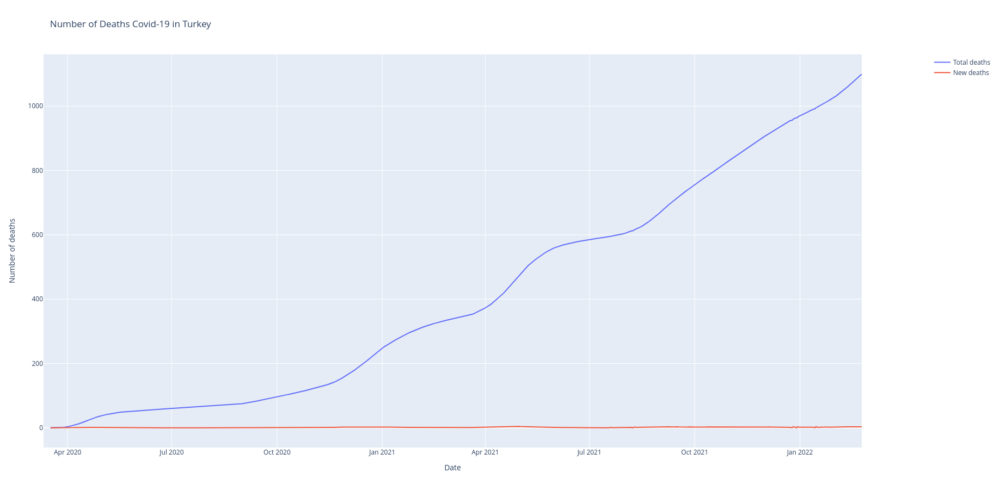
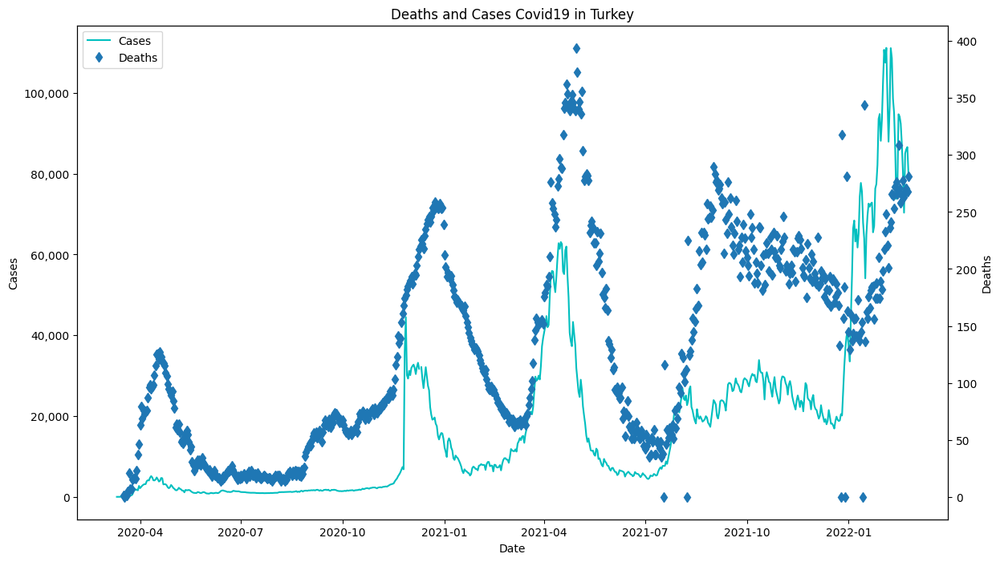
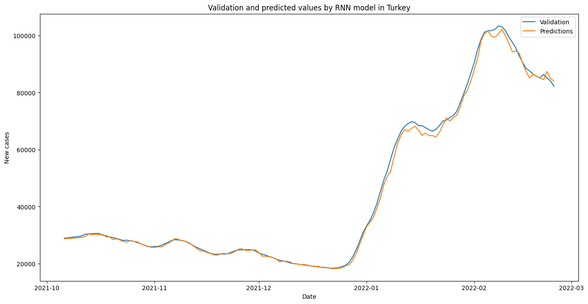

# Covid19-data-analysis-and-forecasting-model

### About The Project
The Covid19 process has affected the whole world very badly. With this epidemic, which has been in our lives for a long time, a lot of data has been collected on a country basis. In this project, various images were obtained by analyzing data and a prediction model was created with Keras.
With ```pip install requirements_linux.txt``` , you can install the modules and libraries used with their versions.

### Built with
* Python

### Visualizations
This project used Argument Parser which works very well in Python.
Turkey was selected as the location of my own printouts.
Sample code;
```python3 visualize.py --location Turkey```

Some plots;

The following image was dynamically structured using the plotly library and saved in html format. You can examine it in more detail. New cases and total cases for Turkey from April 2020 to January 2022;


The following image was dynamically structured using the plotly library and saved in html format. You can examine it in more detail. New deaths and total deaths for Turkey from April 2020 to January 2022;


Cases and deaths for Turkey are compared in the plot below.


### Model and Train
The KerasTrainer class was created using the object-oriented program in the model.py file. It can be tested and results visualized using the visualize_predicts and is_testing arguments.
```python3 train.py --is_testing --visualize_predicts```

Result Plot;

